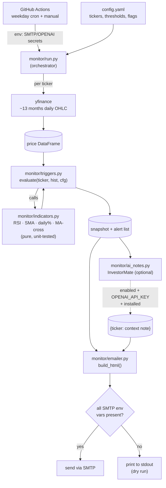

# watchlist-monitor

A scheduled stock-watchlist alert tool that runs **free on GitHub Actions**.

It pulls live daily price data, computes technical indicators (RSI, SMA,
daily move %), checks user-defined trigger thresholds, and emails an HTML
report. It is an **alert** tool — it reports conditions that are true *now*;
it never forecasts prices or gives buy/sell advice.

---

## How it works



**Pipeline in one breath:** `run.py` reads `config.yaml`, pulls ~13 months of
daily data per ticker via **yfinance**, hands each price frame to
`triggers.evaluate()` (which computes indicators in `indicators.py` and fires
human-readable alerts), optionally enriches with an **InvestorMate** context
note, then `emailer.py` renders an HTML report and either emails it or — if any
SMTP var is missing — prints it (dry run). One bad ticker or a missing optional
dependency never aborts the run.

| File | Responsibility | Pure? |
|------|----------------|-------|
| `config.yaml` | All user knobs — no code edits needed | — |
| `monitor/indicators.py` | RSI, SMA, daily %, MA-crossover math | ✅ side-effect-free |
| `monitor/triggers.py` | Turn indicators into snapshot + alert strings | ✅ |
| `monitor/ai_notes.py` | Optional InvestorMate context note per ticker | ❌ (network) |
| `monitor/emailer.py` | Build HTML, send via SMTP or print (dry run) | ❌ (I/O) |
| `monitor/run.py` | Orchestrate fetch → evaluate → notes → email | ❌ (I/O) |
| `.github/workflows/daily.yml` | Weekday cron + manual trigger | — |

---

## Quick start

### 1. Clone and install

```bash
git clone https://github.com/YOUR_USER/watchlist-monitor.git
cd watchlist-monitor
pip install -r requirements.txt
```

### 2. Edit `config.yaml`

```yaml
tickers:
  - AAPL
  - MSFT
  - SPY

triggers:
  daily_move_pct: 3.0   # alert if |daily change| ≥ 3%
  rsi_oversold:   30    # alert if RSI ≤ 30
  rsi_overbought: 70    # alert if RSI ≥ 70
  ma_short: 50          # golden/death cross short window
  ma_long:  200         # golden/death cross long window

always_send_summary: true   # false → email only when alerts fire
```

### 3. Dry run (no email credentials needed)

```bash
python -m monitor.run
```

The HTML report is printed to stdout. Add SMTP credentials (see below) to send
real email.

---

## Email setup — Gmail app password

> Regular Gmail passwords will not work. You need an **App Password**.

1. Go to <https://myaccount.google.com/security>
2. Under **"How you sign in to Google"**, enable 2-Step Verification if it is
   not already on.
3. Search for **App passwords** (or go to
   <https://myaccount.google.com/apppasswords>).
4. Create a new app password — give it any name (e.g. "watchlist-monitor").
5. Copy the 16-character password shown.

SMTP settings for Gmail:

| Variable    | Value                  |
|-------------|------------------------|
| `SMTP_HOST` | `smtp.gmail.com`       |
| `SMTP_PORT` | `587`                  |
| `SMTP_USER` | your full Gmail address |
| `SMTP_PASS` | the 16-char app password |
| `MAIL_TO`   | recipient address      |

### Local testing with credentials

```bash
export SMTP_HOST=smtp.gmail.com
export SMTP_PORT=587
export SMTP_USER=you@gmail.com
export SMTP_PASS=abcd efgh ijkl mnop
export MAIL_TO=you@gmail.com
python -m monitor.run
```

---

## GitHub Actions setup

The workflow in `.github/workflows/daily.yml` runs Monday–Friday at ~21:30 UTC
(4:30 PM ET). You can also trigger it manually from the **Actions** tab.

### Store credentials as GitHub Secrets

In your repository go to **Settings → Secrets and variables → Actions → New
repository secret** and add each of the following:

| Secret name    | Value                            |
|----------------|----------------------------------|
| `SMTP_HOST`    | `smtp.gmail.com`                 |
| `SMTP_PORT`    | `587`                            |
| `SMTP_USER`    | your Gmail address               |
| `SMTP_PASS`    | your 16-char Gmail app password  |
| `MAIL_TO`      | recipient email address          |
| `OPENAI_API_KEY` | *(optional)* for AI notes      |

**Never commit credentials to the repository.**

---

## AI context notes (InvestorMate)

The tool can attach a short qualitative context note per ticker, generated by
[InvestorMate](https://pypi.org/project/investormate/) (`Investor.ask`).

It activates only when **all three** are true:

1. `investormate` is installed (it's in `requirements.txt`).
2. `OPENAI_API_KEY` is set in the environment (or as a GitHub Secret).
3. `config.yaml` has `ai_analysis.enabled: true`.

If any is missing, the run continues silently with no AI section. A failure on
one ticker never aborts the others.

```yaml
ai_analysis:
  enabled: true
  question: "What recent news themes or sector backdrop are most relevant to this stock right now?"
```

Guardrails are appended to your question automatically so the note stays neutral
qualitative **context** — never a price forecast or a buy/sell recommendation.

> **Dependency note:** InvestorMate pins `yfinance` to the `0.2.x` line, so
> `requirements.txt` caps it at `<0.3`.

---

## Web UI (track interests + portfolio, daily suggestions)

A FastAPI + vanilla-JS dashboard lets you manage everything interactively —
no `config.yaml` editing required.

```bash
pip install -r requirements.txt
uvicorn webapp.main:app --reload
# open http://127.0.0.1:8000
```

Tabs:

- **Dashboard** — every interest + holding with live price, daily %, RSI,
  MA-cross, fired alerts, a **signal assessment**, and (if enabled) an AI
  context note. "Refresh now" re-fetches.
- **Portfolio** — add holdings (shares + cost basis); see live market value and
  unrealized P&L per holding and in total.
- **Interests** — add individual tickers *or* a theme/sector (e.g. `ai`,
  `energy`) that expands to representative tickers.
- **Settings** — trigger thresholds, AI toggle/question, daily-email scheduler,
  preview/send a test email, and "Export to config.yaml" (so the GitHub Actions
  cron can pick up your watchlist).

### State & scheduling

- UI state lives in a local **SQLite** DB (`watchlist.db`, git-ignored; path
  overridable via `WATCHLIST_DB`). On first launch it seeds from `config.yaml`.
- An optional in-app **APScheduler** job (toggle in Settings) sends the daily
  email on weekdays — independent of the GitHub Actions workflow.

### Signal assessment vs. advice

The dashboard's assessment is a **deterministic, indicator-grounded read**
("Technically weak — RSI 27 is oversold; factors to weigh: …"). It is
**decision-support, never a buy/sell/hold recommendation**, and the app
**never places trades**. The persistent footer banner says so. The optional
InvestorMate AI note carries the same guardrails.

> **Note:** the UI seeds its thresholds from `config.yaml` on first run. If you
> previously set test thresholds there, fix them in the **Settings** tab (or
> delete `watchlist.db` after restoring sane defaults in `config.yaml`).

## Running tests

```bash
pytest
```

---

## Disclaimer

This tool identifies current technical conditions as of market close.
It does **not** forecast prices, predict future performance, or constitute
financial advice. Always conduct your own research before making any
investment decision.
